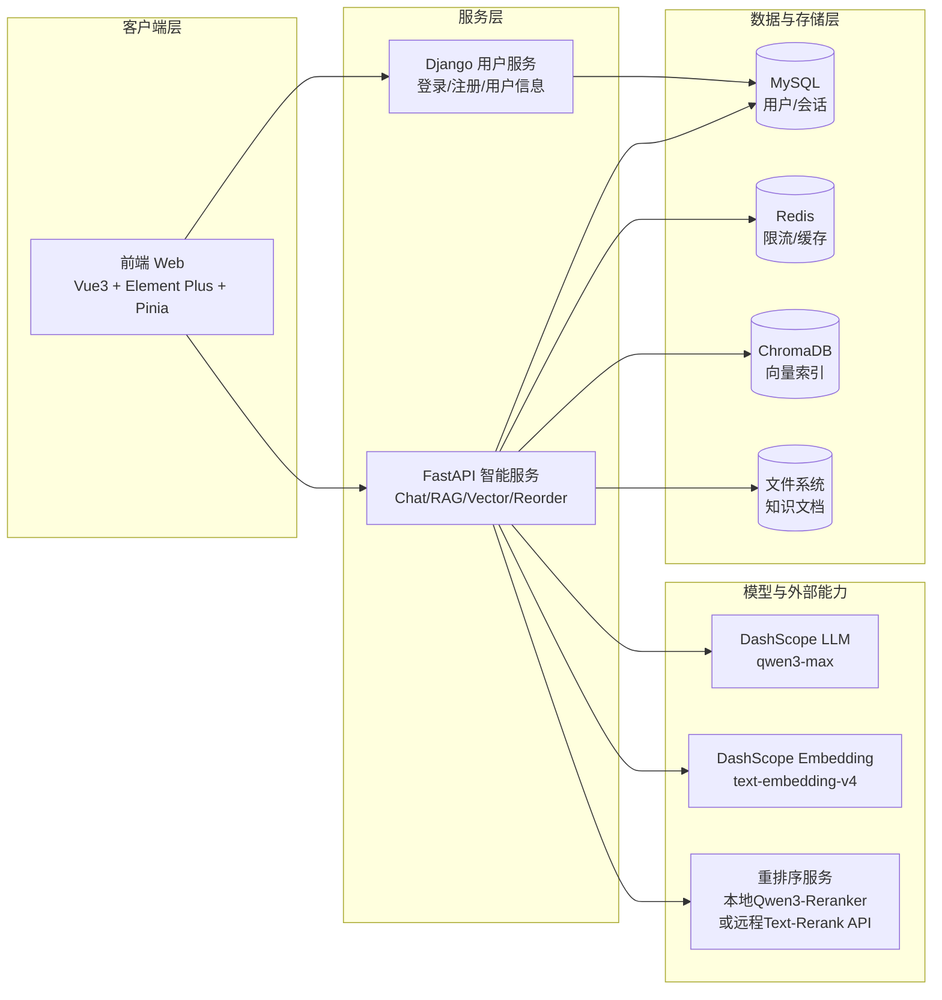
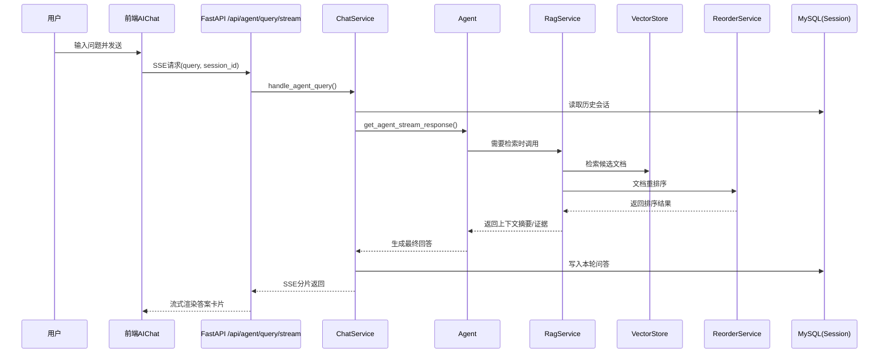

# 软件设计文档（体系结构级 + 构件级）

## 1. 文档目的

本文档用于满足课程“3.5 核心工作流要求”中的软件设计条款：

- （3）软件设计：至少包括一个软件体系结构级和/或构件级的设计文档。

本文同时给出：

1. 体系结构级设计（系统级）
2. 构件级设计（后端核心模块级）

---

## 2. 体系结构级设计

### 2.1 架构风格

系统采用前后端分离 + 微服务协作架构：

- 前端：Vue3 + Element Plus
- 智能服务：FastAPI（RAG、Agent、会话、知识库）
- 用户服务：Django（认证与用户信息）
- 数据层：MySQL + Redis + ChromaDB + 文件系统
- AI服务：DashScope（LLM、Embedding）、可选本地/远程重排序服务

### 2.2 高层体系结构图

### 2.3 分层职责

- 客户端层：页面渲染、会话交互、状态管理、认证态维护。
- 服务层：业务编排、权限校验、流式响应、检索增强、工具调用。
- 数据层：结构化数据持久化、缓存限流、向量检索、文档存储。
- AI层：LLM推理、向量嵌入、重排序评分。

---

## 3. 构件级设计（FastAPI智能服务）

### 3.1 核心构件与职责

| 构件 | 主要职责 | 关键依赖 |
|---|---|---|
| `router/chat.py` | 暴露 `/api/agent/query/stream`、`/api/rag/query`、`/api/vector/*`、`/api/reorder` | `ChatService` |
| `router/chat_service.py` | 路由业务编排、会话/向量/重排序调度 | `RagService`、`VectorStoreService`、`reorder_service` |
| `rag/rag_service.py` | 检索、重排序、摘要生成 | `VectorStoreService`、`reorder_service`、`chat_model` |
| `rag/vector_store.py` | 文档向量化、检索器构建、文档删除 | ChromaDB、文件系统 |
| `rag/reorder_service.py` | 文档重排序（本地模型或远程API） | `sentence-transformers` / `requests` |
| `services/session_manager` | 会话历史持久化与读取 | MySQL |
| `core/rate_limit.py` | 接口限流中间件 | Redis |

### 3.2 关键流程（用户问答）

### 3.3 构件约束

- 认证：需要JWT用户身份。
- 限流：关键接口均经过 Redis 限流中间件。
- 会话一致性：写会话应在响应结束后落库。
- 重排序策略：优先远程 API（若配置 `RERANKER_API_URL`），否则使用本地模型。

---

## 4. 关键接口设计（摘录）

- `POST /api/agent/query/stream`：智能体流式问答
- `POST /api/rag/query`：RAG摘要问答
- `GET /api/sessions/{user_id}`：用户会话列表
- `GET /api/session/{session_id}`：会话历史
- `DELETE /api/session/{session_id}`：删除会话
- `POST /api/vector/add/single`：单文件上传入库
- `POST /api/vector/add/multiple`：多文件上传入库
- `DELETE /api/vector/clean`：清空用户向量文档
- `POST /api/reorder`：文档重排序测试

---

## 5. 非功能设计要点

- 性能：SSE流式输出降低首字延迟；Redis限流保护后端。
- 可扩展：Django用户服务与FastAPI智能服务分离，便于独立扩容。
- 可维护：RAG、Agent、重排序、会话管理按模块解耦。
- 可部署：支持本地推理与远程API混合模式，降低服务器资源压力。

---

## 6. 与课程3.5要求映射

本文件已覆盖：

- 软件体系结构级设计（2章）
- 构件级设计（3章）

可作为“（3）软件设计”过程产出文档直接提交。
