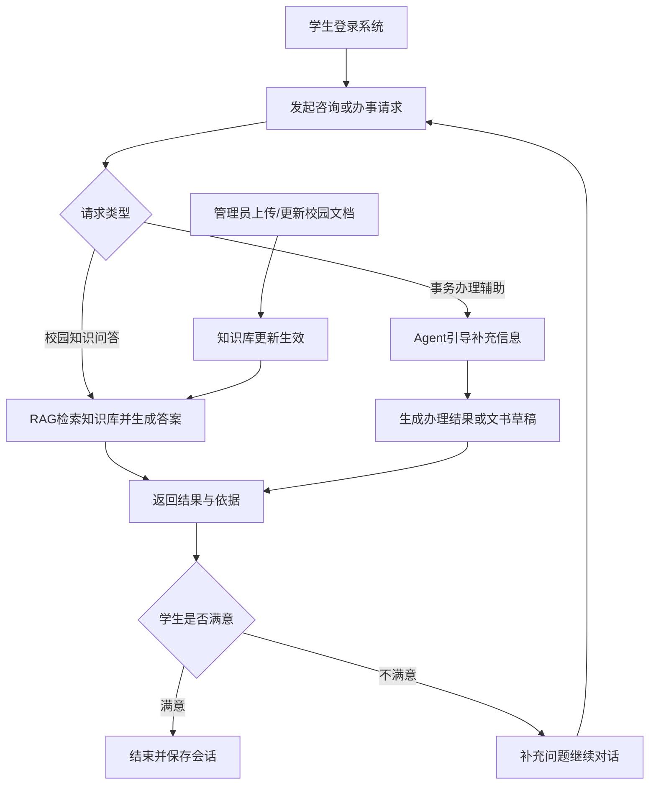

面向学生的校园服务智能体平台（CampusAgent）

Software Architecture Document (SAD)

课程名称：

专 业： [软件工程]{.underline}

姓 名：

班 级：

完成日期：

该软件架构文档模板，参考了SEI "Views and Beyond"
架构文档模板和ISO/IEC/IEEE 42010:2011
架构描述模板，并根据实践经验对模板文档结构进行了适当裁剪和调整。

### 1.引言

**1.1目的及范围**

本架构文档旨在系统化描述“面向学生的校园服务智能体平台（CampusAgent）”的整体结构、关键组件、交互方式以及主要设计决策，帮助开发、测试、评审、运维等角色在统一的架构视角下协同工作。文档范围涵盖：

CampusAgent 平台的核心能力与职责划分；

各类架构视图（逻辑、开发、运行、部署、用例）的结构描述与关联关系；

项目开发计划、核心工作流与软件设计（体系结构级/构件级）的对齐说明；

主要需求、质量属性与架构设计之间的映射及支撑策略。

**1.2 文档结构**

文档的组织结构如下：

第一部分 引言

本部分主要概述了文档内容组织结构，使读者能够对文档内容进行整体了解，并快速找到自己感兴趣的内容。同时，也向读者提供了架构交流所采用的视图信息。

第二部分 架构背景

本部分主要介绍了软件架构的背景，向读者提供系统概览，建立开发的相关上下文和目标。分析架构所考虑的约束和影响，并介绍了架构中所使用的主要设计方法，包括架构评估和验证等。

第三、四部分 视图及其之间的关系

视图描述了架构元素及其之间的关系，表达了视图的关注点、一种或多种结构。

第五部分 需求与架构之间的映射

描述系统功能和质量属性需求与架构之间的映射关系。

第六部分 附录

提供了架构元素的索引，同时包括了术语表、缩略语表。

**1.3视图编档说明**

所有的架构视图都按照标准视图模板中的同一种结构进行编档。

**1.4 课程要求 3.4 / 3.5 对齐说明**

为满足课程“3.4 项目开发计划要求”与“3.5 核心工作流要求（软件设计）”，本节明确给出迭代计划与设计产物对应关系。

1）项目开发计划（3周，单迭代 7-10 天）

| 迭代 | 周期 | 目标 | 关键交付 |
| --- | --- | --- | --- |
| 迭代1 | 第1周（7天） | MVP主链路打通 | 用户注册/登录、统一智能体对话入口、RAG问答、SSE流式响应、会话管理 |
| 迭代2 | 第2周（7天） | 核心业务能力扩展 | 知识库上传与向量维护、教师信息查询、课表服务、课程规划（基础） |
| 迭代3 | 第3周（7天） | 场景增强与验收交付 | 选课建议、校园导航、文书辅助、性能与安全检查、验收测试与发布文档 |

2）核心工作流与软件设计（3.5）

- 体系结构级设计：见第3章中的逻辑视图、运行视图、部署视图，覆盖“前端层-API层-服务层-数据层-模型层”的分层架构。
- 构件级设计：见第3章中的服务模块与工作节点（RAG、Agent、Session、Vector、User Service）职责拆分与接口约定。
- 工作流覆盖：学生问答流程、会话管理流程、知识更新流程、文书辅助流程、管理端运维流程。
- 交付结论：本文件即为课程要求中的“软件体系结构级和/或构件级设计文档”主文档。

3）核心工作流主流程图（学生侧）

### 2.架构背景

**2.1系统概述**

CampusAgent 面向高校学生校园服务场景，允许用户通过自然语言发起问答与事务请求并获得可追溯结果。系统采用前后端分离与微服务架构：前端基于 Vue3 提供统一对话入口与业务页面；后端由 FastAPI 承载 RAG、Agent、会话与知识库能力，Django 用户服务承载注册登录与个人资料能力。系统重点支持校园知识问答、课表服务、课程规划、选课建议、校园导航、文书辅助与知识库管理等能力。

**2.2架构需求**

2.2.1 操作需求

- Python 3.12+ 运行环境（FastAPI/Django 后端），Node.js 16+（Vue3 前端）。

- 支持 Windows/Linux 部署，开发环境采用 uv、npm/pnpm；生产可容器化部署。

- 关键中间件包含 MySQL（用户与会话持久化）、Redis（缓存与限流）、ChromaDB（向量检索）。

- 模型与检索能力采用 DashScope LLM/Embedding + RAG + Reorder（本地/远程双模式）。

- 通过 `.env`、`rag.yaml`、`chroma.yaml` 管理模型参数、API 凭据与索引配置。

2.2.2 功能需求

**UC-01**：用户注册、登录、注销与个人资料管理。

**UC-02**：校园知识问答（校规、通知、办事流程等）并展示引用来源。

**UC-03**：统一智能体多轮对话与上下文记忆，会话可查看、删除、续聊。

**UC-04**：知识库文档上传、向量化构建、向量清理与重排测试。

**UC-05**：课表查询（今日/周课表）与冲突提醒。

**UC-06**：课程规划与学分进度分析，生成学期修课建议。

**UC-07**：选课建议（保稳/提升/兴趣/考研/就业等策略）。

**UC-08**：校园导航（地点检索与路径建议）。

**UC-09**：申请文书辅助（生成、检查、优化）。

**UC-10**：管理员运维与质量保障（日志、限流、监控、版本发布）。

2.2.3 质量属性需求

**可用性（Availability）**

CampusAgent 应能够稳定提供校园问答与事务辅助服务。

(1) 系统目标服务时间为每天 24 小时、每周 7 天。

(2) 年平均可用性不低于 99%。

(3) 单服务实例故障应在 60 秒内被检测并记录。

(4) 服务应在 5 分钟内完成重启或切换恢复。

(5) 已创建会话与已提交请求不因单点故障而丢失。

**性能（Performance）**

(1) 常规校园问答请求平均响应时间不超过 5 秒。

(2) 流式对话接口应在 3 秒内返回首个有效分片。

(3) 在课程实训演示负载下（约 50-100 并发）不发生系统崩溃。

**安全性（Security）**

(1) 系统需提供用户身份认证（JWT）与接口鉴权。

(2) 对个人敏感数据（课表、账号信息）实施权限控制与传输保护。

(3) 记录登录、会话访问、管理操作等审计日志。

(4) 检测异常访问时触发限流与告警，保障核心服务可用。

**可修改性（Modifiability）**

(1) 新增校园业务模块（如导航、文书）应尽量不改动核心对话链路。

(2) 接口契约统一管理，支持“已实现/待新增”并行开发。

(3) 模块间遵循低耦合原则，避免级联修改。

**可移植性（Portability）**

(1) 支持本地开发环境与容器化部署环境。

(2) 迁移环境时主要通过配置调整完成，不依赖特定硬件。

**可测试性（Testability）**

(1) 核心服务接口具备可独立测试的输入输出边界。

(2) 支持日志追踪请求链路，便于问题定位与回归验证。

**可维护性（Maintainability）**

(1) 代码结构按职责分层（前端/业务后端/用户服务/数据层）。

(2) 关键配置集中管理，便于维护与环境切换。

(3) 文档与接口说明与实现同步更新。

**可伸缩性（Scalability）**

(1) 业务后端与用户服务可独立横向扩展。

(2) 向量检索、会话管理与鉴权链路可按模块独立优化。

**可部署性（Deployability）**

(1) 支持分服务部署与回滚。

(2) 部署过程不破坏已有用户与会话数据。

**用户体验/易用性（Usability）**

(1) 学生以自然语言即可完成问答和事务辅助请求。

(2) 回答结果需尽可能提供来源引用与边界提示。

(3) 交互流程支持多轮对话、会话管理与错误提示。

    **2.3主要设计决策及原理**

<!-- -->

1.  微服务分层设计（前端/业务后端/用户服务）\
    系统将“校园业务能力”与“用户认证能力”拆分为独立服务：FastAPI 负责智能对话、RAG、会话与知识库；Django 负责用户注册登录与个人信息。该拆分降低耦合、提升并行开发效率，并利于独立扩缩容。

2.  RAG + Agent 协同主链路\
    针对校园问答与事务辅助场景，系统采用“检索增强 + 智能体编排”组合：RAG 提供可追溯事实依据，Agent 负责多轮意图识别、任务分发与结果组织；在知识不足时给出免责声明，降低幻觉风险。

3.  会话持久化与流式交互\
    对话入口采用 SSE 流式响应（提升体感速度），会话元数据与历史消息持久化到 MySQL，支持会话列表、续聊、删除等完整生命周期管理，以满足教学演示与真实使用场景。

4.  知识库可运维设计\
    向量库能力以“上传-切分-索引-检索-重排”流水线实现，并提供单/多文件上传、向量清理、重排测试等管理接口，保障知识更新可控、可回归、可验证。

5.  可演进的业务模块化策略\
    围绕 `fw.md` 的业务范围，将课表、课程规划、选课建议、校园导航、文书辅助设计为可独立演进模块；接口先行定义（已实现/待新增分层管理），支撑前后端并行联调与后续迭代扩展。

6.  可观测与安全治理\
    通过 JWT 鉴权、Redis 限流、结构化日志与异常追踪提升系统稳定性；同时采用“官方知识优先、建议而非决策”的业务边界策略，降低误导风险并满足校园场景合规要求。

### 3.视图

**3.1 逻辑视图**

**3.1.1 顶层逻辑视图**

**3.1.1.1主表示**

图3.1.1.1 CampusAgent 顶层逻辑图

Excalidraw 源文件：`media/excalidraw/3.1.1.1-top-logic.excalidraw`

**3.1.1.2构件目录**

A.构件及其特性

  ---------------- -------------------------------------------------------------------------
       *构件*                                       *描述*

    用户交互层      前端 `front`（AIChat、Sessions、KnowledgeManage、登录/注册/个人中心）
                              提供统一校园服务入口与会话交互体验。

   API接入与鉴权层    FastAPI 路由（`/api/*`）与 Django 用户服务路由（`/user/*`）共同构成
                              北向接口；通过 JWT 鉴权与 Redis 限流保护核心接口。

   对话编排服务层     `ChatService`、`get_agent_response/get_agent_stream_response` 负责会话驱动、
                              任务编排、SSE 流式响应与统一结果组织。

   知识检索与重排层    `RagService` + `VectorStoreService` + `ReorderService` 负责混合检索
                              （向量+BM25）、HyDE、文档重排与知识库问答。

   会话与用户服务层    `DatabaseSessionManager` 维护会话生命周期与消息历史；Django 用户服务
                              提供注册、登录、资料维护、头像上传等能力。

    数据存储层       MySQL（用户与会话）、ChromaDB（向量索引）、文件存储（知识文档与结果资产）、
                              Redis（缓存与限流）。

   模型与外部能力层    DashScope LLM/Embedding、重排序模型（本地 CrossEncoder 或远程 API）、
                              可扩展第三方校园业务接口。

    观测治理层       结构化日志、错误追踪、接口限流、部署与运维脚本，保障可观测性与可维护性。
  ---------------- -------------------------------------------------------------------------

B.关系及其特性

（1）依赖关系：

用户交互层依赖 API 接入与鉴权层完成统一调用、认证和限流。

API 接入与鉴权层依赖对话编排服务层与会话/用户服务层处理核心业务请求。

对话编排服务层依赖知识检索与重排层完成 RAG 问答与证据组织。

知识检索与重排层依赖数据存储层获取向量索引、知识文档与缓存能力。

对话编排服务层与知识检索层共同依赖模型与外部能力层完成生成、嵌入和重排。

全链路依赖观测治理层进行日志采集、异常追踪与运行治理。

（2）使用关系：

学生请求经前端发起后，先进入 FastAPI/Django 接口层完成鉴权，再路由到对话编排或用户服务。

对话请求由编排层拉取历史会话，按需调用 RAG 检索、重排与模型推理，再通过 SSE/JSON 返回。

知识库管理请求通过向量服务完成文档上传、切分、索引写入与清理，并将处理状态写入日志。

会话与用户相关操作分别落库到 MySQL，对检索与调用过程中的关键指标统一上报治理层。

C.元素接口

无

D.元素行为

无

**3.1.1.3上下文图**

无

**3.1.1.4可变性**

可按需扩展接入终端（移动端、小程序、Webhook），复用现有鉴权与限流策略。

可独立扩展前端业务页面（课表、规划、选课、导航、文书）而不破坏对话主链路。

可按模块扩容 RAG、会话、用户服务与重排能力，支持高并发与灰度演进。

可新增第三方校园业务接口（教务、地图、公告系统）并通过统一适配层接入。

**3.1.1.5原理**

顶层逻辑采用“前端交互 + 双后端服务（FastAPI/Django）+ 数据与模型支撑 + 观测治理”的分层协作方式：

前端统一承载学生交互；FastAPI 聚焦对话、RAG 与会话链路；Django 聚焦用户域认证与资料管理；
Redis/MySQL/ChromaDB 分别承担限流缓存、结构化持久化与向量检索；模型层通过 DashScope 与重排服务
提供生成与排序能力；治理层通过日志与限流保障系统可观测和可控。

**3.1.1.6相关视图**

子视图包：图3.1.2.1 Agent服务逻辑视图,图3.1.3.1 工具与工作节点逻辑视图

兄弟视图包：图3.2.1.1 CampusAgent 顶层开发视图,图3.3.1.1 CampusAgent
顶层运行视图,图3.4.1.1 CampusAgent部署视图,图3.5.1.1
CampusAgent顶层用例视图

**3.1.2 Agent服务逻辑视图**

**3.1.2.1主表示**

图3.1.2.1 Agent服务逻辑视图

Excalidraw 源文件：`media/excalidraw/3.1.2.1-agent-logic.excalidraw`

**3.1.2.2构件目录**

A.构件及其特性

  --------------------- --------------------------------------------------------
         *构件*                                  *描述*

       AgentFactory               `backend/app/agent/agent.py` 中的工厂，按请求
                                  创建全新 `AgentExecutor`，避免全局状态污染。

     AgentExecutor实例            由 `create_tool_calling_agent` 构建，执行
                                  `input + chat_history + system_prompt` 推理流程。

       默认工具集合                `rag_summary_tools`、`reorder_documents_tools`、
                                  `get_user_info_tools`、`get_weather_tools`、`what_time_is_now`。

     会话上下文桥接层              `app/services/__init__.py` 的 `SessionManagerProxy`
                                  与 `DatabaseSessionManager`，负责读取/写入会话历史。

       提示词与模型层              `load_prompt('main_prompt')` + `ChatTongyi(qwen3-max)`
                                  共同定义 Agent 行为边界与模型调用参数。

      流式响应输出器               `get_agent_stream_response` 以 SSE 连续输出
                                  `response/error/done` 事件并写回会话。

      观测与中间件钩子             `traceable`、`logger`、`agent_middleware` 提供
                                  运行跟踪、步骤日志与治理扩展点。
  --------------------- --------------------------------------------------------

B. 关系及其特性

（1）依赖关系：

`/api/agent/query/stream` 入口直接调用 `get_agent_stream_response`，由其内部依赖
`SessionManagerProxy + AgentFactory + ToolSet` 完成流式对话。

`ChatService.handle_agent_query` 走非流式链路，调用 `get_agent_response`，共享同一
Agent 工厂与工具体系。

工具执行依赖 `RagService`、`ReorderService` 与 `decode_django_jwt` 等底层能力。

（2）使用关系：

Agent 每次执行前读取会话历史，执行后将最终回答持久化到 MySQL 会话表。

在流式执行中，`intermediate_steps` 被转换为可审计步骤日志，支撑问题定位与调优。

C.元素接口

无

D.元素行为

{width="5.586805555555555in"
height="1.5611111111111111in"}

图3.1.2.2 Agent服务状态图

Excalidraw 源文件：`media/excalidraw/3.1.2.2-agent-state.excalidraw`

**3.1.2.3上下文图**

图3.1.2.3 Agent服务上下文图

**3.1.2.4可变性**

可扩展新的接口适配方式（HTTP API、Webhook）以支持更多终端接入。

可替换上下文存储实现（内存、Redis、数据库），支持跨节点会话。

可切换推理调度方式（同步调用、异步队列、批处理）。

**3.1.2.5原理**

Agent 服务以“工厂化执行器 + 工具调用 + 会话持久化”三段式组织：

通过 `AgentFactory` 为每次请求创建新的 `AgentExecutor`，避免上下文污染；
执行过程中按需调用 RAG/重排/用户信息等工具；
最终将结果写入 `DatabaseSessionManager`，形成可追溯的多轮对话闭环。

**3.1.2.6相关视图**

父视图：图3.1.1.1 CampusAgent 顶层逻辑图

兄弟视图：图3.1.3.1 工具与工作节点逻辑视图

**3.1.3 工具与工作节点逻辑视图**

**3.1.3.1主表示**

图3.1.3.1 工具与工作节点逻辑视图

Excalidraw 源文件：`media/excalidraw/3.1.3.1-tool-worker-logic.excalidraw`

**3.1.3.2构件目录**

A.构件及其特性

  --------------------- --------------------------------------------------------
         *构件*                                  *描述*

      rag_summary工具              `rag_summary_tools(query)`：触发 `RagService`
                                  的“检索+重排+摘要”并返回文档证据。

      reorder工具                  `reorder_documents_tools(query, documents)`：
                                  调用重排服务返回排序与相似度结果。

      user_info工具                `get_user_info_tools(token)`：通过
                                  `decode_django_jwt` 解析用户ID与用户名。

      weather/time工具             `get_weather_tools`、`what_time_is_now`：
                                  提供轻量规则型工具能力。

      RagService节点               负责 HyDE 假设文档生成、混合检索、重排后摘要整合。

    VectorStoreService节点         负责文档加载、切分、向量写入、BM25+向量检索器构建。

     ReorderService节点            支持本地 CrossEncoder 与远程 API 双模式重排序。
  --------------------- --------------------------------------------------------

B. 关系及其特性

（1）依赖关系：

`rag_summary_tools` 依赖 `RagService.get_documents_and_summary`，而该流程继续依赖
`VectorStoreService` 与 `ReorderService`。

`reorder_documents_tools` 直接依赖 `reorder_service.reorder_documents`，作为独立重排能力暴露。

`get_user_info_tools` 依赖 JWT 解码能力，仅在用户明确询问身份信息时调用。

（2）部分关系：

工具节点被 `AgentFactory` 注册为默认工具集，由 `AgentExecutor` 在中间步骤中按需选择。

工具输出统一回流到 Agent 推理上下文，最终进入会话持久化链路。

C.元素接口

无

D.元素行为

{width="5.5784722222222225in"
height="1.3756944444444446in"}

图3.1.3.2 工具与工作节点状态图

Excalidraw 源文件：`media/excalidraw/3.1.3.2-tool-state.excalidraw`

**3.1.3.3上下文图**

图3.1.3.3 工具与工作节点上下文图

**3.1.3.4可变性**

可在 `agent_tools.py` 新增工具函数并接入 `AgentFactory` 默认工具集。

可在不改上层接口的前提下替换重排后端（本地 CrossEncoder / 远程 API）。

可扩展文档解析类型与向量检索策略（切分参数、权重策略、文件类型白名单）。

**3.1.3.5原理**

工具层通过统一函数签名向 Agent 暴露能力，执行链路由 `AgentExecutor` 自动选择工具并回填中间步骤；
RAG、重排、用户信息等能力保持独立服务实现，从而实现“工具可插拔、底层可替换、上层对话接口稳定”。

**3.1.3.6相关视图**

父视图：图3.1.1.1 CampusAgent 顶层逻辑图

兄弟视图：图3.1.2.1 Agent服务逻辑视图

**3.2 开发视图**

**3.2.1 顶层开发视图**

**3.2.1.1主表示**

图3.2.1.1 CampusAgent顶层开发视图

Excalidraw 源文件：`media/excalidraw/3.2.1.1-top-development.excalidraw`

**3.2.1.2构件目录**

A.构件及其特性

  --------------- ------------------------------------------------------------------------------------------
      *构件*                                                *描述*

    前端交互工程        `front/src` 下的 AIChat、Sessions、KnowledgeManage 及功能页面，
                                           提供校园服务统一入口与多轮交互体验。

   API 接入与鉴权组件   `backend/app/router` 与 `DjangoUserService/apps/*/urls.py` 提供
                                           `/api/*` 与 `/user/*` 接口，统一承载认证、限流与路由。

    对话编排组件        `chat_service.py`、`agent.py` 实现会话驱动、任务编排、SSE 流式输出。

   RAG 检索与重排组件   `rag_service.py`、`vector_store.py`、`reorder_service.py` 组成检索增强链路。

   会话与用户服务组件   `database_session_manager.py` + Django `apps/user` 共同实现会话持久化与用户管理。

    数据存储组件        MySQL、ChromaDB、Redis 与知识文档存储目录，支撑状态、索引与缓存。

   模型与外部能力组件   DashScope LLM/Embedding、重排序模型（本地或远程 API）及可扩展校园接口。

     观测治理组件       `logger_handler`、限流中间件、部署与文档资产，支撑运维观测与治理。
  --------------- ------------------------------------------------------------------------------------------

B.关系及其特性

（1）使用关系：

前端交互工程通过 API 接入与鉴权组件访问后端能力，并依赖 JWT 与限流策略保障安全。

API 接入组件将对话请求路由至对话编排组件，将用户请求路由至 Django 用户服务组件。

对话编排组件按需调用 RAG 检索与重排组件，并结合会话服务完成上下文拼装与结果返回。

RAG 组件依赖数据存储组件中的 ChromaDB/文档目录，模型与外部能力组件提供生成与重排能力。

观测治理组件横切 API、编排、检索和用户服务链路，统一记录日志与运行指标。

（2）包含关系：

API 接入与鉴权组件包含 FastAPI 路由组与 Django 路由组。

对话编排组件包含会话读取、Agent 调用、SSE 输出与结果封装子流程。

会话与用户服务组件包含会话历史管理、用户认证、资料维护与文件上传子模块。

数据存储组件包含关系库、向量库、缓存与文件存储子资源，可按部署策略独立扩容。

C.元素接口

无

D.元素行为

无

**3.2.1.3上下文图**

无

**3.2.1.4可变性**

可新增前端业务页面或导航入口，不影响既有 API 与对话主链路。

可新增 FastAPI 路由与服务方法，按接口契约扩展新校园业务能力。

可替换重排序后端（本地模型/远程 API）并保持上层调用不变。

可独立扩容 Django 用户服务、向量检索与缓存组件，支持分阶段演进。

**3.2.1.5原理**

以“前端交互 + 双后端服务（FastAPI/Django）+ 数据与模型支撑”的分层方式组织开发，
通过模块解耦保障并行开发效率，并通过统一接口契约保障跨模块协同。

**3.2.1.6相关视图**

子视图包：图3.2.2.1 FastAPI 业务后端模块开发视图,图3.2.3.1 Django 用户服务模块开发视图

兄弟视图包：图3.1.1.1 CampusAgent 顶层逻辑视图,图3.3.1.1 CampusAgent
顶层运行视图,图3.4.1.1 CampusAgent部署视图,图3.5.1.1
CampusAgent顶层用例视图

**3.2.2 FastAPI 业务后端模块开发视图**

**3.2.2.1主表示**

{width="6.283333333333333in"
height="2.2006944444444443in"}

图3.2.2.1 FastAPI 业务后端模块开发视图

Excalidraw 源文件：`media/excalidraw/3.2.2.1-fastapi-dev.excalidraw`

**3.2.2.2构件目录**

A.构件及其特性

  ---------------- ------------------------------------------------------------------
       *构件*                                    *描述*

    ChatRouter        `backend/app/router/chat.py`，定义对话、RAG、会话、向量与重排接口。

    ChatService       `backend/app/router/chat_service.py`，承接路由层并组织业务流程。

    AgentRunner       `backend/app/agent/agent.py`，提供流式与非流式智能体响应能力。

    RagService        `backend/app/rag/rag_service.py`，提供 HyDE、检索、重排与摘要生成。

  VectorStoreService  `backend/app/rag/vector_store.py`，处理文档切分、向量写入与检索器构建。

   ReorderService     `backend/app/rag/reorder_service.py`，支持本地/远程重排序。

   SessionManager     `backend/app/services/database_session_manager.py`，管理会话与消息历史。

   AuthRateLimit      `auth_utils.py` 与 `rate_limit.py`，统一鉴权与频控治理。

   DataModelSchema    `models/chat_history.py` 与 `schemas/models.py`，定义持久化与接口数据模型。
  ---------------- ------------------------------------------------------------------

B.关系及其特性

`chat.py` 中 `/api/rag/query`、`/api/session/*`、`/api/sessions/*`、`/api/vector/*`、`/api/reorder`
通过依赖注入调用 `ChatService`，并在入口侧施加限流与鉴权。

`/api/agent/query/stream` 为特例：直接调用 `get_agent_stream_response` 返回 SSE，
不经过 `ChatService.handle_agent_query`。

`ChatService` 负责非流式 Agent、RAG、向量上传清理、重排测试与会话查询删除等业务编排。

RagService 调用 VectorStoreService 与 ReorderService 完成“检索-重排-生成”链路。

`services/__init__.py` 的 `SessionManagerProxy` 将会话调用代理到
`DatabaseSessionManager`，并由 `models/chat_history.py` / `schemas/models.py` 保证数据契约。

C.元素接口

无

D.元素行为

图3.2.2.2 FastAPI 模块状态图

Excalidraw 源文件：`media/excalidraw/3.2.2.2-fastapi-state.excalidraw`

**3.2.2.3上下文图**

见3.1.2.3上下文图

**3.2.2.4可变性**

可新增业务路由与服务方法，保持现有接口分组与数据契约不变。

可替换模型与重排后端实现，不影响上层调用路径。

可按需扩展向量处理与检索策略以适配不同知识规模。

**3.2.2.5原理**

通过路由层、服务层、检索层、持久层分离，构建可维护且可扩展的 FastAPI 业务模块。

**3.2.2.6相关视图**

父视图：图3.2.1.1 CampusAgent 顶层开发视图

兄弟视图：图3.2.3.1 Django 用户服务模块开发视图

**3.2.3 Django 用户服务模块开发视图**

**3.2.3.1主表示**

图3.2.3.1 Django 用户服务模块开发视图

Excalidraw 源文件：`media/excalidraw/3.2.3.1-django-dev.excalidraw`

**3.2.3.2构件目录**

A.构件及其特性

  ----------------- --------------------------------------------------------------
       *构件*                                   *描述*

   UserUrlsRouter      `apps/user/urls.py` 与 `apps/file/urls.py`，暴露用户与文件相关接口。

    UserViews          `apps/user/views.py`、`apps/file/views.py`，承接请求并组织响应。

  UserSerializers      `apps/user/serializers.py`、`apps/file/serializers.py`，执行参数校验与数据转换。

   UserAuthCore        `apps/user/authentications.py`、`apps/secret/make_it_secret.py`，提供令牌与认证能力。

    UserModels         `apps/user/models.py`，管理用户、资料及关联实体。

   UtilityModules      `apps/utils/cache_utils.py`、`rate_limit_utils.py`，提供缓存与频控支撑。

   DjangoSettings      `DjangoUserService/settings.py` 与中间件配置，管理全局运行参数。
  ----------------- --------------------------------------------------------------

B.关系及其特性

UserUrlsRouter 将请求分发至 UserViews。

UserViews 依赖 UserSerializers 完成请求校验与响应序列化，依赖 UserAuthCore 完成认证鉴权。

UserViews 依赖 UserModels 读写用户与资料数据，UtilityModules 提供缓存与频控辅助。

DjangoSettings 统一管理数据库、跨域、中间件与安全策略，支撑服务稳定运行。

C.元素接口

无

D.元素行为

用户服务实例按“认证 → 校验 → 业务处理 → 数据持久化 → 响应”流程执行。

**3.2.3.3上下文图**

见3.1.3.3上下文图

**3.2.3.4可变性**

可在 `apps/user`、`apps/file` 下新增业务接口并复用现有鉴权框架。

可替换缓存与限流实现策略以适配不同部署规模。

可扩展认证机制（如多端登录、额外风控策略）而不影响 FastAPI 主链路。

**3.2.3.5原理**

通过 Django 应用分层（URL、View、Serializer、Model）构建稳定的用户域服务，
与 FastAPI 业务域解耦，提升并行开发与独立部署能力。

**3.2.3.6相关视图**

父视图：图3.2.1.1 CampusAgent 顶层开发视图

兄弟视图：图3.2.2.1 FastAPI 业务后端模块开发视图

**3.3 运行视图**

**3.3.1 顶层运行视图**

**3.3.1.1主表示**

图3.3.1.1 CampusAgent顶层运行视图

Excalidraw 源文件：`media/excalidraw/3.3.1.1-top-runtime.excalidraw`

**3.3.1.2构件目录**

A.构件及其特性

  -------------------- --------------------------------------------------------------
         *构件*                                    *描述*

      终端客户端          浏览器中的 Vue3 前端，发起对话、会话与知识库管理请求。

     FastAPI 服务实例      承载 `/api/*` 能力：SSE 对话、RAG 检索、会话管理、向量管理。

    Django 用户服务实例    承载 `/user/*` 等用户域接口：注册、登录、资料与文件能力。

      会话与关系数据库      MySQL 持久化用户、会话与消息记录。

     向量检索与文档存储     ChromaDB 与文档目录承载知识索引与原始资料。

      缓存与限流组件       Redis 提供缓存、频控及高频访问保护。

      模型与重排服务       DashScope 与重排序后端（本地/远程）提供生成、嵌入和重排能力。

       观测治理通道        日志、错误追踪与运行指标上报链路。
  -------------------- --------------------------------------------------------------

B.关系及其特性

（1）连接关系：

终端客户端通过 HTTPS 访问 FastAPI 与 Django 服务。

FastAPI 服务实例访问 MySQL、ChromaDB、Redis 及模型与重排服务，完成对话主链路。

Django 用户服务实例访问 MySQL 与缓存组件，完成用户域请求处理。

FastAPI 与 Django 的关键运行事件统一汇入观测治理通道。

C.构件接口

无。

D.构件行为

无。

**3.3.1.3上下文图**

无。

**3.3.1.4可变性**

可独立扩缩容 FastAPI 与 Django 运行实例，以匹配不同业务压力。

可切换模型与重排后端（本地/远程 API）并保持对外接口稳定。

可按请求类型调整缓存与限流策略，提升高并发下的稳定性。

可将运行日志与指标接入更完整的链路追踪体系，增强故障定位能力。

**3.3.1.5原理**

运行流程采用“前端请求驱动 + FastAPI 业务编排 + Django 用户域处理 + 数据与模型支撑”的协作模式，
在保证接口一致性的同时实现服务解耦、弹性扩展与可观测治理。

**3.3.1.6相关视图**

子视图包：图3.3.2.1 FastAPI 服务实例运行视图,图3.3.3.1 Django 用户服务实例运行视图

兄弟视图包：图3.1.1.1 CampusAgent 顶层逻辑视图,图3.2.1.1 CampusAgent
顶层开发视图,图3.4.1.1 CampusAgent部署视图,图3.5.1.1
CampusAgent顶层用例视图

**3.3.2 FastAPI 服务实例运行视图**

**3.3.2.1主表示**

{width="5.764583333333333in"
height="2.520138888888889in"}图3.3.2.1 FastAPI 服务实例运行视图

Excalidraw 源文件：`media/excalidraw/3.3.2.1-fastapi-runtime.excalidraw`

**3.3.2.2构件目录**

A.构件及其特性

  ---------------- --------------------------------------------------------
       *构件*                               *描述*

    API 路由入口        `chat.py` 暴露 `/agent/query/stream`、`/rag/query`、`/session/*` 等接口。

    服务编排层          `ChatService` 统一编排会话、RAG、向量与重排流程。

    Agent 流式执行层    `get_agent_stream_response` 提供 SSE 增量输出能力。

    RAG 检索链路        `RagService` + `VectorStoreService` + `ReorderService` 完成检索增强。

    会话管理层          `DatabaseSessionManager` 负责会话历史读取、写入与删除。

    鉴权限流层          `get_current_user_id` 与 `rate_limit` 保护关键接口。
  ---------------- --------------------------------------------------------

B.关系及其特性

API 路由入口依赖鉴权限流层完成安全校验，并将请求转发至服务编排层。

服务编排层按请求类型调用 Agent 流式执行层或 RAG 检索链路，并调用会话管理层持久化历史。

RAG 检索链路依赖向量存储与重排服务，将结果回传给服务编排层统一响应。

C.构件接口

无

D.构件行为

图 3.3.2.2 FastAPI 服务模块行为序列图

Excalidraw 源文件：`media/excalidraw/3.3.2.2-fastapi-sequence.excalidraw`

**3.3.2.3上下文图**

见3.1.2.3上下文图

**3.3.2.4可变性**

可按业务场景扩展新的路由与服务方法，复用既有鉴权与限流策略。

可替换模型供应商与重排后端实现，不影响上层接口契约。

**3.3.2.5原理**

通过“路由层-服务层-检索层-持久层”分离，保障请求链路清晰、可测和易扩展。

**3.3.2.6相关视图**

父视图：图3.3.1.1 CampusAgent 顶层运行视图

兄弟视图包：图3.3.3.1 Django 用户服务实例运行视图

**3.3.3 Django 用户服务实例运行视图**

**3.3.3.1主表示**

{width="5.580555555555556in"
height="3.1034722222222224in"}图3.3.3.1 Django 用户服务实例运行视图

Excalidraw 源文件：`media/excalidraw/3.3.3.1-django-runtime.excalidraw`

**3.3.3.2构件目录**

A.构件及其特性

  --------------- -------------------------------------------------------
      *构件*                              *描述*

    URL 路由层          `apps/user/urls.py`、`apps/file/urls.py` 定义用户域运行入口。

    视图处理层          `views.py` 处理注册登录、资料管理与文件接口请求。

    认证鉴权层          `authentications.py` 与密钥工具提供令牌校验能力。

   序列化校验层         `serializers.py` 进行参数校验、数据转换与响应格式化。

    持久化模型层        `models.py` 与 MySQL 交互，落地用户与资料数据。

    缓存频控层          `cache_utils.py`、`rate_limit_utils.py` 提供性能与安全保护。
  --------------- -------------------------------------------------------

B.关系及其特性

（1）连接关系：

URL 路由层将请求分发至视图处理层，视图处理层依赖认证鉴权层完成身份校验。

视图处理层调用序列化校验层与持久化模型层完成业务处理，并按需使用缓存频控层。

C.构件接口

无。

D.构件行为

图 3.3.3.2 Django 用户服务行为序列图

Excalidraw 源文件：`media/excalidraw/3.3.3.2-django-sequence.excalidraw`

**3.3.3.3上下文图**

见3.1.3.3上下文图

**3.3.3.4可变性**

可扩展用户域接口并复用现有认证中间件。

可替换缓存策略与限流策略以适配不同并发规模。

**3.3.3.5原理**

通过 Django 的 MTV/DRF 分层方式组织用户域运行流程，保障安全、稳定与可维护。

**3.3.3.6相关视图**

父视图：图3.3.1.1 CampusAgent 顶层运行视图

兄弟视图：图3.3.2.1 FastAPI 服务实例运行视图

**3.4 部署视图**

**3.4.1主表示**

图3.4.1.1 CampusAgent部署视图

Excalidraw 源文件：`media/excalidraw/3.4.1.1-deployment.excalidraw`

**3.4.1.2构件目录**

A.构件及其特性

  ------------------- -------------------------------------------------------
        *构件*                                *描述*

      前端部署单元        Web 前端构建产物（Nginx/静态托管）对外提供页面访问能力。

    FastAPI 服务单元      业务后端部署单元，提供 `/api/*` 对话、检索、会话与知识库接口。

   Django 用户服务单元    用户域后端部署单元，提供 `/user/*` 认证与资料接口。

      MySQL 数据库       持久化用户、会话、消息等结构化数据。

      Redis 服务         提供缓存、限流计数与短期状态存储。

   Chroma/文档存储单元    向量索引与知识文档存储，可采用本地卷或对象存储。

   模型与外部API单元      DashScope 与重排 API 服务，为生成与检索链路提供外部能力。

    观测与日志单元        统一收集 FastAPI、Django 与中间件运行日志与指标。
  ------------------- -------------------------------------------------------

B.关系及其特性

前端部署单元通过 HTTPS 分别调用 FastAPI 与 Django 服务单元。

FastAPI 与 Django 均连接 MySQL；FastAPI 额外依赖 Redis、Chroma/文档存储和模型外部 API。

两类后端单元统一接入观测与日志单元，实现告警与问题追踪闭环。

C.构件接口

无

D.构件行为

无

**3.4.1.3上下文图**

无

**3.4.1.4可变性**

可独立扩缩容 FastAPI 与 Django 单元，按业务压力分层弹性。

可替换数据库、缓存或对象存储部署形态（本地/云托管）而不改变业务接口。

可切换重排后端为本地模型或远程 API，实现成本与性能平衡。

可将观测栈升级为集中日志平台与链路追踪平台，提升运维诊断能力。

**3.4.1.5原理**

部署拓扑遵循"分层解耦 + 弹性伸缩 +
观测驱动"原则，保证平台能够在多租户、高并发场景下保持可用性与可维护性，同时便于逐步演进至云原生架构。

**3.4.1.6相关视图**

兄弟视图包：图3.1.1.1 CampusAgent 顶层逻辑视图,图3.2.1.1 CampusAgent
顶层开发视图,图3.3.1.1 CampusAgent 顶层运行视图,图3.5.1.1
CampusAgent顶层用例视图

**3.5 用例视图**

**3.5.1 顶层用例视图**

**3.5.1.1主表示**

图3.5.1.1 CampusAgent顶层用例视图

Excalidraw 源文件：`media/excalidraw/3.5.1.1-top-usecase.excalidraw`

**3.5.1.2构件目录**

1、构件及其特性

  ---------------------------- -------- --------------------------------------------------------------------------------------------
             *构件*             *类型*                                             *描述*

            高校学生            参与者                            通过 Web 端完成登录、对话、RAG问答、会话管理。

           系统管理员           参与者                 维护知识库、用户信息与系统运行配置（迭代故事中的管理角色）。

      FastAPI 业务后端           系统          提供 `/api/agent/query/stream`、`/api/rag/query`、会话与向量接口。

      Django 用户服务            系统                提供 `/user/*` 与 `/file/upload/` 用户认证和资料相关能力。

      DashScope与重排服务         系统              提供 LLM、Embedding 与重排（本地/远程）能力。

   SC-1 用户登录注销              用例            对应故事卡1，已实现（`/user/login`、`/user/logout`、JWT鉴权）。

   SC-2 对话界面交互              用例            对应故事卡2，已实现（`AIChat.vue` + SSE 实时输出）。

   SC-3 RAG知识问答              用例            对应故事卡3，已实现（`RagService` 检索增强问答）。

   SC-7 对话记忆管理              用例            对应故事卡7，已实现（`DatabaseSessionManager` + `/api/session*`）。

   SC-4 请假条生成               用例            对应故事卡4，部分实现（Agent可执行生成类任务，模板导出待完善）。

   SC-5 课表解析                 用例            对应故事卡5，规划中（前端路由已预留，后端专用解析接口未落地）。

   SC-6 课程信息查询             用例            对应故事卡6，规划中（前端路由/接口常量已预留）。

   SC-8 智能办事指南             用例            对应故事卡8，规划中（可复用 Agent+RAG，业务知识与流程库待补齐）。

  SC-9~SC-11 管理后台能力        用例            对应故事卡9~11，当前仓库仅覆盖用户域基础能力，完整后台待扩展。

  SC-12~SC-13 并发与安全         用例            对应故事卡12~13，已部分实现（Redis限流、JWT、会话隔离）。
  ---------------------------- -------- --------------------------------------------------------------------------------------------

2、关系及其特性

学生侧主价值流为：`SC-1 登录` → `SC-2 对话交互` → `SC-3 RAG问答`/`SC-7 会话管理`。

`SC-4/SC-5/SC-6/SC-8` 复用同一 Agent+RAG 基础能力，其中 SC-4 为在研可用，SC-5/6/8 属于下一阶段扩展。

管理员与主管部门需求（SC-9~SC-13）通过 Django 用户域、Redis 限流、JWT 与日志治理逐步承接，
其中“完整新闻后台与主题管理”尚未在当前代码仓完整落地。

3、构件接口

无

4、构件行为

无

**3.5.1.3上下文图**

无

**3.5.1.4可变性指南**

可新增业务用例（如奖助、就业、宿舍服务）并复用现有对话与鉴权链路。

可将管理员能力细分为知识运营、系统运维等角色并扩展权限边界。

**3.5.1.5原理**

通过“角色-系统-用例”分离，明确学生侧价值流与管理侧治理流，
并将能力映射到 FastAPI 与 Django 两类后端服务，实现职责清晰与演进友好。

**3.5.1.6相关视图**

兄弟视图包：图3.1.1.1 CampusAgent 顶层逻辑视图,图3.2.1.1 CampusAgent
顶层开发视图,图3.3.1.1 CampusAgent 顶层运行视图,图3.4.1.1
CampusAgent部署视图

### 4.视图之间关系

4.1视图之间关系说明

CampusAgent 的架构视图遵循“逻辑层职责 → 开发层模块 → 运行时协作 → 部署落位”的映射关系：

逻辑视图定义用户交互、API鉴权、对话编排、RAG、会话与用户服务、数据存储、模型外部能力、观测治理等责任边界。

开发视图将上述责任边界映射到 `front`、`backend/app`、`DjangoUserService/apps` 以及数据库与中间件配置。

运行视图展示前端请求如何在 FastAPI 与 Django 两条链路中流转，并访问 MySQL、ChromaDB、Redis 与模型服务。

部署视图说明前端、FastAPI、Django、数据库、缓存、向量存储与外部模型能力在基础设施中的落位关系。

4.2 视图-视图关系

**（1）顶层逻辑视图与顶层开发视图关系**

| 逻辑视图层 | 开发视图构件 |
| --- | --- |
| 用户交互层 | `front/src` 页面与组件（AIChat、Sessions、KnowledgeManage 等） |
| API接入与鉴权层 | `backend/app/router/*`、`DjangoUserService/apps/*/urls.py`、鉴权与限流中间件 |
| 对话编排服务层 | `backend/app/router/chat_service.py`、`backend/app/agent/agent.py` |
| 知识检索与重排层 | `backend/app/rag/rag_service.py`、`vector_store.py`、`reorder_service.py` |
| 会话与用户服务层 | `backend/app/services/database_session_manager.py`、`DjangoUserService/apps/user/*` |
| 数据存储层 | MySQL 配置、Chroma 配置、Redis 配置与文档存储目录 |
| 模型与外部能力层 | DashScope 与重排 API 配置（`.env`、模型参数） |
| 观测治理层 | `logger_handler`、限流工具、部署与运维文档 |

**（2）顶层开发视图与运行视图关系**

| 开发视图构件 | 运行视图构件 |
| --- | --- |
| `front/src` 前端工程 | 终端客户端（浏览器中的 Vue3 页面） |
| FastAPI 路由与服务模块 | FastAPI 服务实例 |
| Django 用户服务模块 | Django 用户服务实例 |
| 会话与用户数据模型 | MySQL 会话与关系数据库 |
| 向量检索与文档模块 | ChromaDB 与文档存储 |
| 缓存与限流配置 | Redis 缓存与限流组件 |
| 模型与重排配置 | 模型与重排服务（本地/远程） |
| 日志与治理代码 | 观测治理通道 |

**（3）顶层运行视图与部署视图关系**

| 运行视图构件 | 部署视图构件 |
| --- | --- |
| 终端客户端 | 用户设备 / 浏览器节点 |
| FastAPI 服务实例 | FastAPI 服务单元（容器或进程） |
| Django 用户服务实例 | Django 用户服务单元（容器或进程） |
| MySQL 会话与关系数据库 | MySQL 数据库实例 |
| ChromaDB 与文档存储 | Chroma/文档存储单元（卷或对象存储） |
| Redis 缓存与限流组件 | Redis 服务实例 |
| 模型与重排服务 | 模型与外部 API 单元 |
| 观测治理通道 | 观测与日志单元 |

### 5.需求与架构之间的映射

**5.1 功能需求映射**

| 迭代故事卡 | 架构落位（源码） | 当前状态 |
| --- | --- | --- |
| SC-1 用户登录注销 | `DjangoUserService/apps/user/views.py`、`apps/user/authentications.py`、`front/src/views/Login.vue` | 已实现 |
| SC-2 对话界面UI | `front/src/views/AIChat.vue`、`/api/agent/query/stream` SSE | 已实现 |
| SC-3 RAG知识库问答 | `backend/app/rag/rag_service.py`、`vector_store.py`、`reorder_service.py`、`/api/rag/query` | 已实现 |
| SC-4 请假条自动生成 | `backend/app/agent/agent.py` + `agent_tools.py`（任务型对话能力） | 部分实现 |
| SC-5 课表解析 | `front/src/views/Schedule.vue`、`front/src/config/api.js`（预留接口） | 规划中 |
| SC-6 课程信息查询 | `front/src/views/CoursePlan.vue`/`CourseRecommend.vue`、预留课程接口 | 规划中 |
| SC-7 对话记忆 | `backend/app/services/database_session_manager.py`、`/api/session/*`、`/api/sessions/*` | 已实现 |
| SC-8 智能办事指南 | Agent+RAG 架构可承载，业务知识与专项工具待补齐 | 规划中 |
| SC-9 新闻资讯管理 | 当前仓库未提供完整新闻内容管理模块 | 未实现 |
| SC-10 主题风格切换 | 前端具备页面结构，统一主题系统待建设 | 未实现 |
| SC-11 用户管理与权限 | Django 用户域 + JWT 基础能力已具备，细粒度权限待扩展 | 部分实现 |
| SC-12 并发承载能力 | `core/rate_limit.py`、Redis 限流、SSE 流式输出 | 部分实现 |
| SC-13 数据隔离安全 | JWT 鉴权、会话归属校验（403）、用户缓存隔离 | 已实现 |

**5.2 质量属性需求映射**

| 质量属性 | 架构支撑点 |
| --- | --- |
| 可用性 | FastAPI 与 Django 服务解耦，关键数据持久化；异常可快速重启和恢复 |
| 性能 | SSE流式响应、Redis缓存与限流、检索重排优化 |
| 安全性 | JWT鉴权、接口权限控制、审计日志与异常告警 |
| 可修改性 | 模块化前后端结构、接口契约分层（已实现/待新增） |
| 可移植性 | 配置化部署，支持本地与容器化环境迁移 |
| 可维护性 | 分层架构+统一配置+文档化接口，便于协同维护 |

**5.3 操作与技术需求映射**

- 运行环境：Python 3.12+、Node.js 16+，分别支撑后端服务与前端工程。
- 数据基础设施：MySQL（用户/会话）、Redis（缓存/限流）、ChromaDB（向量检索）。
- 模型与检索：DashScope LLM/Embedding + RAG + Reorder（本地/远程双模式）。
- 交付与运维：通过接口文档、部署文档与迭代计划支撑 4 周（30天）课程实训周期交付。

### 6.附录

6.1架构元素索引

  ------------------------------- -------------------- -------------------------------------------------------------------------------
  **架构元素**                    **所属层**             **描述**

  `front/src/views/AIChat.vue`    用户交互层             对话主界面，发起 SSE 请求并渲染回答与引用。

  `front/src/views/Sessions.vue`  用户交互层             会话列表、删除、刷新与跳转入口。

  `front/src/views/KnowledgeManage.vue` 用户交互层        知识库单/多文件上传、向量清理、重排测试。

  `backend/main.py`               API入口层              FastAPI 启动入口，挂载路由、全局限流、CORS、启动初始化。

  `backend/app/router/chat.py`    API路由层              定义 `/api/agent/query/stream`、`/api/rag/query`、会话与向量接口。

  `backend/app/router/chat_service.py` 服务编排层        对非流式 Agent、RAG、会话与向量流程进行业务编排。

  `backend/app/agent/agent.py`    Agent执行层            AgentFactory、AgentExecutor、流式/非流式响应核心逻辑。

  `backend/app/agent/agent_tools.py` 工具层              RAG摘要、重排、用户信息、天气、时间等工具定义。

  `backend/app/rag/rag_service.py` RAG层                 HyDE、检索、重排、摘要整合。

  `backend/app/rag/vector_store.py` 检索存储层           文档加载切分、向量写入、BM25+向量混合检索。

  `backend/app/rag/reorder_service.py` 重排层            本地模型与远程API双模式重排序。

  `backend/app/services/database_session_manager.py` 会话层  会话创建、归属校验、历史写入与查询。

  `backend/app/utils/auth_utils.py` 鉴权层               解析 Django JWT、用户缓存回源、当前用户识别。

  `backend/app/core/rate_limit.py` 治理层               Redis 限流依赖与全局中间件。

  `DjangoUserService/apps/user/*` 用户域服务层          注册、登录、刷新Token、资料查询与更新。

  `DjangoUserService/apps/file/*`  用户域服务层          鉴权文件上传与头像更新。

  MySQL / Redis / ChromaDB         数据层               分别承载用户会话、缓存限流与向量检索。
  ------------------------------- -------------------- -------------------------------------------------------------------------------

6.2术语表

  ------------------------------- -------------------------------------------------------------------------------
  **术语**                        **定义**

  AgentFactory                    `agent.py` 中的工厂对象，每次请求创建新的 `AgentExecutor`。

  SSE流式响应                      服务端通过 `text/event-stream` 持续推送回答分片（`response/error/done`）。

  HyDE                            在 RAG 前先生成“假设文档”再检索，提高召回质量。

  混合检索                         `VectorStoreService` 中 BM25 与向量检索融合（EnsembleRetriever）。

  重排双模式                       `ReorderService` 支持本地 CrossEncoder 与远程 API 两种执行路径。

  SessionManagerProxy             `app/services/__init__.py` 中的会话管理代理，桥接全局会话实例。

  JWT黑名单                        在 Redis 中维护失效 token（注销/刷新后），防止旧令牌继续访问。

  故事卡（SC）                     `迭代.md` 中定义的需求单元，用于跟踪“已实现/部分实现/规划中”状态。
  ------------------------------- -------------------------------------------------------------------------------

6.3缩略语

  ---------------- -------------------------------------------------------
  缩略语           全称 / 含义

  API              Application Programming Interface，应用程序接口。

  JWT              JSON Web Token，用于用户身份认证与令牌传递。

  SSE              Server-Sent Events，服务端推送流式响应机制。

  RAG              Retrieval-Augmented Generation，检索增强生成。

  BM25             Best Matching 25，基于词频统计的经典文本检索算法。

  LLM              Large Language Model，大语言模型。

  DRF              Django REST Framework，Django 的 REST API 开发框架。

  UI               User Interface，面向用户的可视化交互界面。

  SDK              Software Development Kit，外部能力接入开发包。

  SLA              Service Level Agreement，服务质量协议。

  KPI              Key Performance Indicator，关键性能指标。
  ---------------- -------------------------------------------------------
